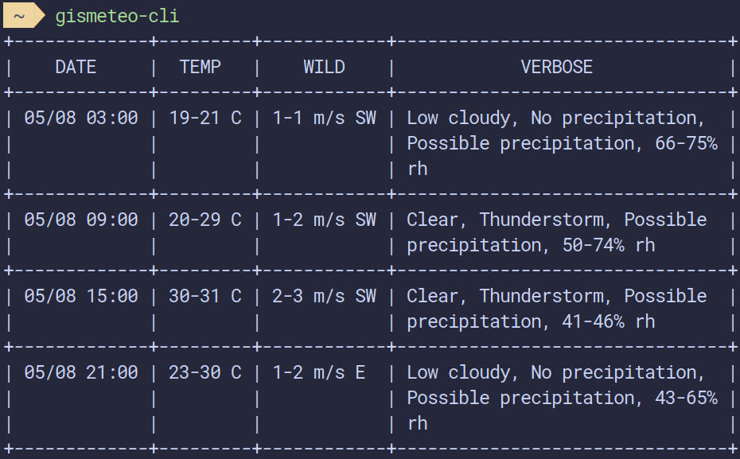

# gismeteo-cli
Command line tool getting weather  



Generate your wanting location an first run of tool.  

Config will saving in **$HOME/.config/gismeteo-cli/list.json**

Example generated config:
```bash
{"Url":"https://xml.meteoservice.ru/export/gismeteo/point/9615.xml"}
```

